# Khal Docs v0.2 α
!!! warning
    Everything here is subject to change!!! This is work-in-progress!

!!! warning
	This document assumes you have a general idea of how Ithkuil noun derivation works. I will rephrase stuff later to ger rid of this assumption.

---

## Phonology

### Consonants
Here is the consonant table:
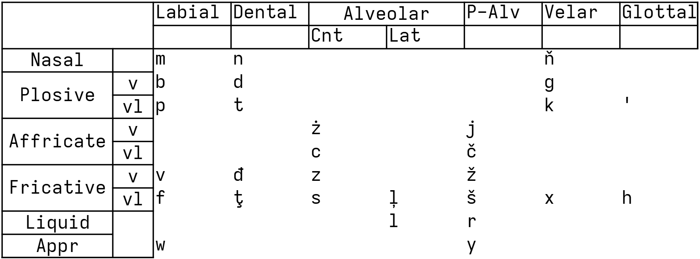
The consonants are: *b c č d đ f g h j k l ļ m n ň p r s š t ţ v w x y z ž ż '*.

c makes the sound \[ts\]

j makes the sound \[dʒ\]

r makes the sound \[ɾ\] or \[r\]

y makes the sound \[j\]

č makes the sound \[tʃ\]

đ makes the sound \[ð\]

ļ makes the sound \[ɬ\]

ň makes the sound \[ŋ\]

š makes the sound \[ʃ\]

ţ makes the sound \[θ\]

ż makes the sound \[dz\]

ž makes the sound \[ʒ\].

#### Aspiration and Palatalization

The sounds *m, n, p, t, b, d, ż, j, c, č, v, f, đ, ţ, z, s, ļ, z̧, ž, š, x, h* are capable of being palatalized.
Palatalization can either be marked with ʸ or with a circumflex. When you need to use a circumflex on top of a letter with a caron or breve, the diacritics turn to a ring.

### Vowels

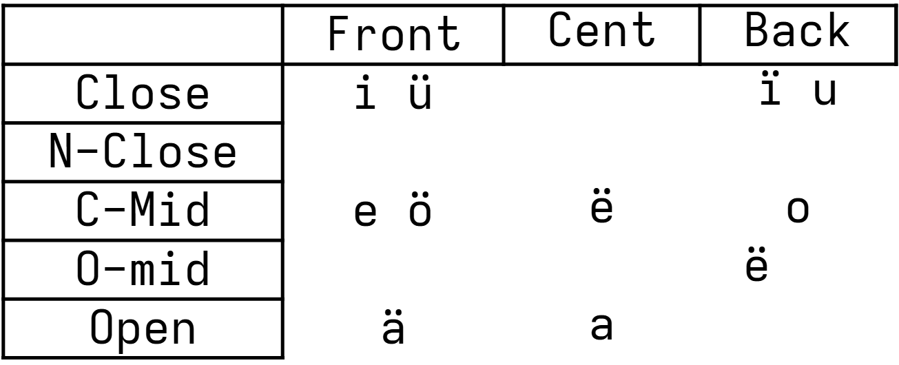
The base vowels are: *a ä e ë i ï o ö u ü*

ä makes the sound \[æ\]

ë make the sound \[ə\] or \[ʌ\]

ï makes the sound \[ɯ\]

ö makes the sound \[ø\] or \[œ\]

ü makes the sound \[y\]

#### Nasalization and Length
All vowels are capable of lengthening.

Length is marked with a macron (ā, ē, ī). If you can't use a macron, either an under-diaresis (i̤, o̤, ṳ) or a colon (i:, o:, u:) is acceptable.

---

## Morphology

| I                                                    | II      | III  | IV                      | V                      | VI                    | VII                               | .          | .   |
| ---------------------------------------------------- | ------- | ---- | ----------------------- | ---------------------- | --------------------- | --------------------------------- | ---------- | --- |
| ((C~H~)                                              | V~S~))  | C~R~ | ((V~C~                  | (C~C~))                | (V~X~C~S~...)+V~T~    | (C~E~))                           | [Tone]     | WIP |
| Collectivity +  Abstraction **or** Numeric Operation | Stemlet | Root | Case **or** Aspect+Mood | Configuration + Number | Suffix **and** Degree | WIP **or** Source (evidentiality) | word class |     |

### Roots
The language has a root system reminiscent of previous versions of Ithkuil. Each root is made up of a pair of consonants.
Here is the table of the root X-L:

| -                   | -                    |
| ------------------- | -------------------- |
| language of khal    | khal speaker         |
| utter(ance) of khal | description of khal  |
| grammar of khal     | khal docs            |

This root fits in the **A3** template of roots. Here is the template of **A3** roots:

| Stem 1: | Stem 2: | 
| ------- | ------- | 
| sl 1    | sl 4    | 
| sl 2    | sl 5    | 
| sl 3    | sl 6    | 

**st** stands for *stem* here. Check out [Root Templates](template.md) for the list of all root templates.

Here is the root *S-J* ('CARDINAL DIRECTION') that I will use in most examples (**E** Template):

<table style="border-collapse:collapse;border-spacing:0" class="tg"><thead><tr><th style="border-color:black;border-style:solid;border-width:1px;font-family:Arial, sans-serif;font-size:14px;font-weight:normal;overflow:hidden;padding:10px 5px;text-align:left;vertical-align:top;word-break:normal" colspan="2"></th><th style="border-color:black;border-style:solid;border-width:1px;font-family:Arial, sans-serif;font-size:14px;font-weight:normal;overflow:hidden;padding:10px 5px;text-align:left;vertical-align:top;word-break:normal" colspan="2"></th></tr></thead><tbody><tr><td style="border-color:black;border-style:solid;border-width:1px;font-family:Arial, sans-serif;font-size:14px;overflow:hidden;padding:10px 5px;text-align:left;vertical-align:top;word-break:normal" colspan="2">compass </td><td style="border-color:black;border-style:solid;border-width:1px;font-family:Arial, sans-serif;font-size:14px;overflow:hidden;padding:10px 5px;text-align:left;vertical-align:top;word-break:normal" colspan="2">magne</td></tr>
<tr><td style="border-color:black;border-style:solid;border-width:1px;font-family:Arial, sans-serif;font-size:14px;overflow:hidden;padding:10px 5px;text-align:left;vertical-align:top;word-break:normal" colspan="2"></td><td style="border-color:black;border-style:solid;border-width:1px;font-family:Arial, sans-serif;font-size:14px;overflow:hidden;padding:10px 5px;text-align:left;vertical-align:top;word-break:normal" colspan="2"></td></tr><tr><td style="border-color:black;border-style:solid;border-width:1px;font-family:Arial, sans-serif;font-size:14px;overflow:hidden;padding:10px 5px;text-align:left;vertical-align:top;word-break:normal" colspan="2"></td><td style="border-color:black;border-style:solid;border-width:1px;font-family:Arial, sans-serif;font-size:14px;overflow:hidden;padding:10px 5px;text-align:left;vertical-align:top;word-break:normal" colspan="2"></td></tr>
<tr><td style="border-color:black;border-style:solid;border-width:1px;font-family:Arial, sans-serif;font-size:14px;overflow:hidden;padding:10px 5px;text-align:left;vertical-align:top;word-break:normal"></td><td style="border-color:black;border-style:solid;border-width:1px;font-family:Arial, sans-serif;font-size:14px;overflow:hidden;padding:10px 5px;text-align:left;vertical-align:top;word-break:normal"></td><td style="border-color:black;border-style:solid;border-width:1px;font-family:Arial, sans-serif;font-size:14px;overflow:hidden;padding:10px 5px;text-align:left;vertical-align:top;word-break:normal"></td><td style="border-color:black;border-style:solid;border-width:1px;font-family:Arial, sans-serif;font-size:14px;overflow:hidden;padding:10px 5px;text-align:left;vertical-align:top;word-break:normal"></td></tr>
<tr><td style="border-color:black;border-style:solid;border-width:1px;font-family:Arial, sans-serif;font-size:14px;overflow:hidden;padding:10px 5px;text-align:left;vertical-align:top;word-break:normal">north</td><td style="border-color:black;border-style:solid;border-width:1px;font-family:Arial, sans-serif;font-size:14px;overflow:hidden;padding:10px 5px;text-align:left;vertical-align:top;word-break:normal">south</td><td style="border-color:black;border-style:solid;border-width:1px;font-family:Arial, sans-serif;font-size:14px;overflow:hidden;padding:10px 5px;text-align:left;vertical-align:top;word-break:normal">east </td><td style="border-color:black;border-style:solid;border-width:1px;font-family:Arial, sans-serif;font-size:14px;overflow:hidden;padding:10px 5px;text-align:left;vertical-align:top;word-break:normal">west</td></tr></tbody></table>

!!! Note
	Roots can never have \<h\>!

#### Stemlets
Here is a list of stem vowels: **a e ı i o ö u ü ä ë**

Examples:

stem 1 *saj*: compass

stem 5 *soj*: south.

stem 10 *sëj*: west.

stem 8 *süj*: latitude

### Consonant Mutation

The root consonant has the ability to mutate. Unlike old versions of Ithkuil, this mutation is always predictable. The table below shows the possible mutations. The only thing different with "exception" consonants is that the case slot becomes mandatory for ease of pronunciation.

The asterisk shows where the original consonant goes.

| Mut. Name  | Mut. Into | Exceptions |
| ---------- | --------- | ---------- |
| 1 (M-type) | *m        | m n        |
| 2 (N-type) | *n        | m n        |
| 3 (L-type) | *l        | l          |
| 4 (S-type) | *s        | s          |
| 5 (Š-type) | *š        | š          |
| 6 (L-type) | *l        | l          |
| 7 (W-type) | *w        | w          |
| 8 (V-type) | *v        | v          |

---

## Cases

| I                                                    | II      | III  | ???IV???                      | V                      | VI                    | VII                               | .          | .   |
| ---------------------------------------------------- | ------- | ---- | ----------------------- | ---------------------- | --------------------- | --------------------------------- | ---------- | --- |
| ((C~H~)                                              | V~S~))  | C~R~ | ???((V~C~???                  | (C~C~))                | (V~X~C~S~...)+V~T~    | (C~E~))                           | [Tone]     | WIP |
| Collectivity +  Abstraction **or** Numeric Operation | Stemlet | Root | ???Case **or** Aspect+Mood??? | Configuration + Number | Suffix **and** Degree | WIP **or** Source (evidentiality) | word class |     |

The default value of the V~C~ slot is *-ë-*.

For example *ësaj* is identical to *saj* because the first *ë* is already the default.
Here are a list of cases:

### Relational

!!! WIP
	this place will be filled later
	
Object
:   Default value. Has the value *-ë-*. The (usually inanimate) participant of the sentence which isn't *really* affected or does anything. For example: "*Kate wants the **cat**.*". Is the cat aware of this? Maybe. Is it affected, i.e. is it changed in any way? No. Did the cat do anything? No. So it is an object here.

	*ësaj*

Tool
:   The thing used to do the action. The pen in "*He signed the document with his pen*".

	*üsaj*: "using the compass"

Patient
:   The entity affected  by the action. "*Kate fed the cat*". Did the cat got affected? Yes. Did it do the action? No. So it is a patient.

	*ïsaj*
	
Experiencer
:   The entity who was forced to experience something. "*The cat sneezed*". Did the cat do the action? Not really. It sneezed without his will. So the cat is the experiencer.

	*isaj*
	
Representer
:   Quote from Ithkuil: "It indicates the party/entity/idea/thought/situation or mental state which triggers an unwilled, affective response or is the trigger for an existential states with no tangibly affected patient".
	
	For example: "*The hammer exemplifies toolship*": The hammer neither does anything or is getting affected. It rather *triggers* or *represents* the idea of what it means to be a tool.
	
	"*The cat possesses a toy*": The cat is neither the doer or the doee here. The cat owning a toy *triggers* the state of possession.
	
	"*That book contains poems*": The poems that are in the book *trigger* the state of containing something.
	
	Hope I explained it well enough.
	
	*ösaj*
	
Effector
:   The entity is changing or affecting the patient in some way. "*Kate hits the cat*" Kate has affected the cat by hitting it. 

	*äsaj*

Reciever
:   The entity that is recieveing something as a result of communication, transfer, transmisison or trade. Some examples: *Give the dog a bone, I’ll tell her your secret, The host introduced me to the guests.* 

	*esaj*

Double-roled
:   Simultaneously the effector and the patient. For example:

"*She dressed herself*": She both dressed someone and got dressed herself.

"*We talked for a few minutes*": That "we" has both the talker and the listener inside of it so it counts.

	*osaj*

| Object | Tool | Patient | Experiencer | Representer | Effector | Receiver | Double-Rolled |
| ------ | ---- | ------- | ----------- | ----------- | -------- | -------- | ------------- |
| (ë)    | ü    | ï       | i           | ö           | ä        | e      | o           |

### Locational

#### Direction of Movement

To 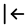
:   Specifies direction towards.

From 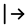
:   Specifies direcion from.

At 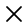
:   Specifies no movement, only location. So the question of direction of movement is invalid.

#### Location

\[vague\] 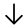
:   Only describes that the location is *there*, doesn't specify *inside*, *above*, *near* etc.

On Surface 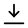
:   On the surface of.

Near
:   In the vicinity of.

Inside
:   Inside of (a container, a building etc.)

|      | vague | on surface | near  | inside |
| ---- | ----- | ---------- | ----- | ------ |
| from | au    | ei         | oa    | iä     |
| to   | ai    | ao         | öë    | ëö     |
| at   | a     | ou         | oi    | ïi      |

#### Temporal

At Time
:	At this time.

#### Other

Description
:   Turns it into an adjective. "could be described as having X properties"

For example: *xal*: the khal language that could be describes as having "cat" properties.

That's how you derive adjectives like "green" or "34" from "greenness" or "34-ness"

Conjunction
:	Turns it into a conjunctor that takes two inputs from both sides.

This is meant to be used with roots like "and" and "or", but you could technically use this case with **every** root. Though the meaning of that conjunction would be up to the speaker.[^conjunct]

For example: *mröï*: \[cat conjunction\]

Equative
: Forms phrases like "*as 'X property' as ...*"

For example: *mrïakh*: as cat-ic as Khal.

| description | conjunction | equative |
| ----------- | ----------- | --------|
|öä       | öï       |ïa|

[^conjunct]: This allows for some wiggle-room that allows the speaker to use and give meaning to conjunctions that aren't defined by the language docs.̧

---

## Configuration

When the configuration is omitted, it is assumed to be a monad (a single entity).
### Numbers
Monad 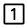
:   Default value. Has the consonant value *-l-*. Represents a single entity.
	
	*amral* (*amra*/*amr*): a cat.

Dyad 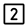
:   Represents two entities treated as a unit.

	*amrat*: a pair of cats.

Triad 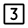
:   Represents three entities treated as a unit.

	*amrađ*: a group of three cats.

Polyad 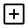
:   Represents more than 6 entities as a unit.

	*amraw*: a group of more than 6 cats.
	
Pleiad 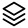
:   Represents one than one entity as a unit.

	*amrah*: a group of more than 1 cat.

Hikanad 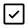
:   Represents an enough amount of entities as a unit. The criteria of "enough" is based on context.

	*amray*: an enough amout of cats

Kenad 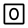
:   Respesents zero entities as a unit.

	*amrar*: zero cats.

Meriad 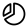
:   Represents a fractional amount of entities as a unit.

	*amras*: a part of a cat.

### Forms

Monads do not fit into any of these categories so monads are classified as vague.

#### Relation

Fused 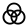
:   Different entities joined into a blob with no boundaries.

	*amram*: two similar cats fused together. (by an evil scientist I suppose)

Connected 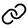
:   Either physically tied or touching, or metaphorically related.

	*amraż*: three cats either tied together, in contact, or related in some way

Seperate 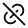
:   Neither connected or fused

	*amrax*: a few unrelated seperate cats. 

#### Similarity

Similar 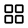
: Entities that share properties with each other.

	*amrad*: a pair of similar cats.

Dissimilar 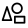
: Entities that dont share any properties with each other.

	*amrap*: a pair of cats that look unlike.

Vague 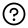
: Similarity not specified.
	
	*amrat*: a pair of cats.

|         | fus sim | fus dsm | con sim | con dsm | sep sim | sep dsm | vague |
| ------- | ------- | ------- | ------- | ------- | ------- | ------- | ----- |
| monad   | ∅     | ∅     | ∅     | ∅     | ∅     | ∅     | l     |
| dyad    | m       | n       | g       | b       | d       | p       | t     |
| triad   | ň     | k       | ż     | j       | č     | v       | đ    |
| polyad  | mʸ     | nʸ     | gʸ     | bʸ     | dʸ     | pʸ     | w     |
| pleiad  | š     | ž     | ţ     | f       | ļ     | x       | h     |
| hikanad | šʸ   | kʸ     | ţʸ   | fʸ     | sʸ     | lʸ     | y     |
| kenad   | r       | r       | r       | r       | r       | r       | r     |
| meriad  | s       | s       | s       | s       | s       | s       | s     |

---

## Verbs

| I                                                    | II      | III  | IV                      | V                      | VI                    | VII                               | .          | .   |
| ---------------------------------------------------- | ------- | ---- | ----------------------- | ---------------------- | --------------------- | --------------------------------- | ---------- | --- |
| ((C~H~)                                              | V~S~))  | C~R~ | ((V~C~                  | (C~C~))                | (V~X~C~S~...)+V~T~    | (C~E~))                           | ???[Tone]???     | WIP |
| Collectivity +  Abstraction **or** Numeric Operation | Stemlet | Root | Case **or** Aspect+Mood | Configuration + Number | Suffix **and** Degree | WIP **or** Source (evidentiality) | ???word class??? |     |

The verbs are generally marked by a mid tone on the penultimate syllable. This mid-tone is marked by either a high-dash (‾) or an apostrophe (').
Example: *'saj*: to be a compass
Question verbs have 2 equivilant ways to mark question:

* Either use the according vowel in the Case slot or
* Pronounce the penultimate syllable with a rising tone (marked with ¨ or ? at the start of the word)
	
	Example: *?saj* or *¨saj*: is X a compass?

Example sentences:

*'saj xal*: The Language of Khal is a compass.

`[verb]-sl11-'cat toy' 'khal language'`

!!! Reminder
	*kh* = *kha* = *khal* = *akh* = *akha* = *akhal* because *-a-* and *-l-* are default values here.

*?xel saj*: Is a compass an utterance of Khal? 

`[ques]-sl9-'khal language' sl2-'meow'`

---

## C~H~ (Collectivity +  Abstraction **or** Numeric Operation) Values

The reason palatalized consonants are nnot allowed in roots is that they are used here. So it doesn't become ambiguous whether a word is C~H~+STEMLET+ROOT (*tʸamr*) or ROOT+CASE+CONFIG (*mrat*).

Abstraction 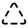
: The abstract general idea of something. Has the value *-tʸ-*.

"I like cats". This "cat" isn't a specific cat, it is an *idea* of a cat. So it would be *tʸamr* (*tʸamra*) here.

Individuality 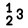
:  Turns "... entities as one unit" into individual entities. *-šʸ-*.

For example: *amrat*: a pair of cats

*šʸamrat*: two cats.

This allows to omit the number adjectives and embed the amount inside the word.

Operations 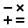
: Does operations with the preceding operation. The preceding number *inherits* the case of the following number, so you can omit the case of the preceding number.

Operations in the Number System section!

*ъxu mr*: 4 cats

*ъx sʸȧxu mr*: 4+2 cats.

!!! Reminder
	More to come later.

---

## Suffixes

| I                                                    | II      | III  | IV                      | V                      | VI                    | VII                               | .          | .   |
| ---------------------------------------------------- | ------- | ---- | ----------------------- | ---------------------- | --------------------- | --------------------------------- | ---------- | --- |
| ((C~H~)                                              | V~S~))  | C~R~ | ((V~C~                  | (C~C~))                | (V~X~C~S~...)+V~T~    | (C~E~))                           | ???[Tone]???     | WIP |
| Collectivity +  Abstraction **or** Numeric Operation | Stemlet | Root | Case **or** Aspect+Mood | Configuration + Number | Suffix **and** Degree | WIP **or** Source (evidentiality) | ???word class??? |     |

Suffixes belong to the (V~X~C~S~...)+V~T~ slot. Suffixes also have degree templates like how roots have stemlet templates. The stem templates are *grouped* with the root templates. So roots can technically use affix templates and affixes can use root templates.

Degree vowels are identical to stemlet vowels.

For example, here is the affix -š:

|R  |
|---|
|Strength from “extremely weak” (1) to “absolutely strong” (9)|

---

## Number System

Here is the root -X-:

|N  |
|---|
|Stemlet numbers indicate cardinal numbers between 1-71. 72rd stemlet is zero.|

Here is the root -G-:

|N  |
|---|
|Stemlet numbers between 1-71 indicate cardinal number multiples of 72. 72nd stemlet is zero.|

Here is the root -GR-:

|N  |
|---|
|Stemlet numbers between 1-71 indicate cardinal number multiples of 72^2^. 72nd stemlet is zero.|

Khal is base 72. Here are some examples of numbers:

*x*: one.

*ïx*: thirteen.

!!! note to myself
	Update the examples below asap

*ą̇̄χ*: sixty-one.

*ğ*: five-thousand one-hundred and eighty-four.

*į̄̇ğ*: three-hundred sixty-eight thousand and sixty four.

*ïχu mr*: thirteen cats.

*ïχu mram*: thirteen pairs of cats.

*ą̇̄χađʸ*: 6 groups of 61.

*ą̇̄χuđʸ mr*: 6 groups of 61 cats.

*ą̇̄χuđʸ mraċ*: 6 groups of 61 groups of 5 cats.

 `sl13-'thirteen'-DESC 'cat'-OBJ-dyad`

| ???I???                                                    | II      | III  | IV                      | V                      | VI                    | VII                               | .          | .   |
| ---------------------------------------------------- | ------- | ---- | ----------------------- | ---------------------- | --------------------- | --------------------------------- | ---------- | --- |
| ???((C~H~)???                                              | V~S~))  | C~R~ | ((V~C~                  | (C~C~))                | (V~X~C~S~...)+V~T~    | (C~E~))                           | [Tone]     | WIP |
| Collectivity +  Abstraction **or** ???Numeric Operation??? | Stemlet | Root | Case **or** Aspect+Mood | Configuration + Number | Suffix **and** Degree | WIP **or** Source (evidentiality) | word class |     |

C~H~ has special values for numbers. They are:

* Subtraction: sʸ
* Addition: ţʸ

When these values are used on a number, it signifies a numeric operation with the preceding number.

*x sʸax*: one plus one.

This is how you express numbers that don't fit in roots -χ- and -Γ-:

*ggr sʸax*: 5185. (lit. 72^2^ + 1) `'72 squared' ADD-sl1-'one'`
